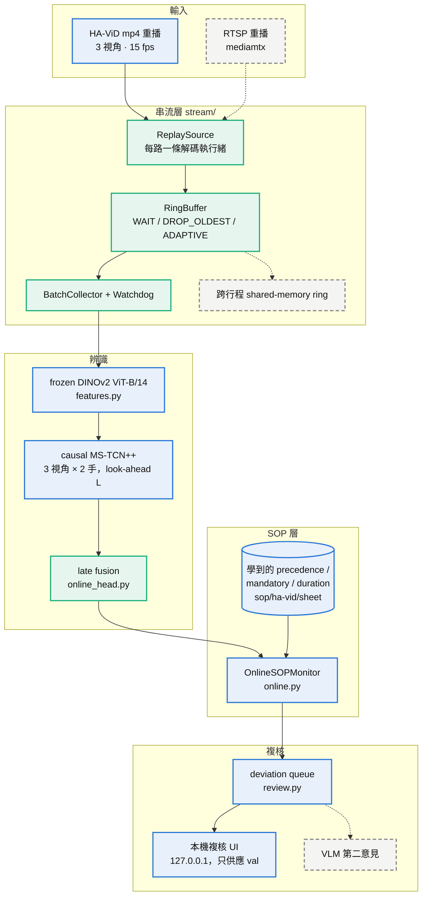

# sop-video-monitor

[](LICENSE)

> **狀態：HA-ViD 的 frozen test split 已依事先登記的 protocol 評估過一次（[`reports/havid_test_v1.md`](reports/havid_test_v1.md)：held-out subjects 上 causal 辨識器 F1@10 27–34，offline 40–42；SOP 檢查在預測序列上仍把每支錄影標記為有偏差），之後不再使用；其餘 HA-ViD 與 IndustReal 數字都是 validation split 上的開發結果。**
> 目前最佳開發結果（validation split，不是 headline）：frozen DINOv2 ViT-B/14 特徵 + causal MS-TCN++ state head +
> procedure-prior decoder，decoder／延遲預算／訓練長度全部在 out-of-fold 上選，POS 0.642 ± 0.035、
> F1 0.821 ± 0.004、mean delay 23.6 s（[`reports/industreal_dev_v11_psr_epochsel_f1/`](reports/industreal_dev_v11_psr_epochsel_f1/)）。
> 每個 run 的所有數字都可從已 commit 的預測表重算（`make reproduce-lite`，CI 也跑）。

## 這個專案是什麼

目標是一套多攝影機 SOP 序列監控系統（CV research flagship，開發中）：HA-ViD 的 left／front／top 三路固定視角
影片以 RTSP 重播進入系統，經 PyAV 解碼、共享 ring buffer、批次特徵抽取與每路 causal 分段頭產生即時步驟後驗；
SOP 狀態機依 task precedence graph 檢查順序、時長與遺漏，把偏差推入佇列，由人工複核 UI 接受或退回，Qwen3-VL-8B
只對被標記的片段提供非同步第二意見。所有辨識指標在 subject-wise 凍結測試集上附 bootstrap CI；串流層附
backpressure 實測曲線。**以上是設計目標，不是現況。** 現況見下方的架構圖（虛線節點就是未做的部分），決策見
[`docs/decisions.md`](docs/decisions.md)，未完成的項目與證據缺口見 [`docs/what_this_does_not_show.md`](docs/what_this_does_not_show.md)。

不做的事：物件偵測主線與 bounding box 輸出（HA-ViD 的 CVAT boxes 只作複核 UI 的輔助視覺化）；真實攝影機、DeepStream 與 edge 部署；
多節點或分散式訓練（所有數字來自單張 RTX 4090）；追 HA-ViD 官方 leaderboard（官方 test 未說明 subject 規則，與本專案的 subject-wise split 不可比）。
哪些宣稱不能出現、各自可以怎麼寫，見 [`docs/claims_audit.md`](docs/claims_audit.md)，發佈前逐條核對。


*元件順序的示意動畫（`make figures`，Manim）；彈出的警報只是示意。真實資料的逐影格重播見下方[動畫圖說](#動畫圖說)。*

## 目前有什麼

### 架構圖：實線＝已實作，綠＝已量測，虛線＝未做



綠色節點的量測在 `reports/stream_bench_v1_dinov2`（24 路 15 fps 即時解碼加抽特徵）與
`reports/havid_dev_v11_online_head_features`（單站三視角從 mp4 到偏差 0.32 倍即時）；串流層與辨識頭
之間的接合尚未做，兩條路徑各自量測（[`docs/streaming.md`](docs/streaming.md)）。監控的狀態機見
[`docs/online_monitor.md`](docs/online_monitor.md)，學到的 SOP 知識畫在 [`docs/sop_knowledge.md`](docs/sop_knowledge.md)。

### 資料

| 資料集 | 角色 | 授權 | 本機狀態 |
|---|---|---|---|
| HA-ViD | 主力 | CC BY-NC 4.0 | 作者交付的 Dropbox 資料夾已下載：3 222 支 RGB 影片（h264、1280×720、15 fps；其中 203 段標註錄影 × 3 視角 = 609 支、14 h，frame 數與標註完全一致）、HR-SAT temporal／collaboration 標註、官方 action-segmentation split 與 I3D 特徵；`wrong` 標籤只有 67 段（test subjects 內 16 段 → ADR 0001 trigger B）；split 已凍結在 `splits/ha-vid/`。depth／skeleton／object-detection 未下載 |
| IMPACT | 備援 | code Apache-2.0；data CC BY-NC-SA 4.0 | 未申請 |
| IndustReal | 指標捐贈／開發 | Apache-2.0 | 86 支 RGB 影片、action 標註、52 支 train/val recording 的 PSR 標註（六包壓縮檔已驗證 MD5）；test 的壓縮檔沒下載 |

實測稽核在 [`reports/data_audit.json`](reports/data_audit.json)（IndustReal）與
[`reports/havid_audit.md`](reports/havid_audit.md)（HA-ViD W1），外部檔案的名稱／大小／SHA-256 在
[`data/manifest.json`](data/manifest.json)，資料落點與授權處理在 [`data/README.md`](data/README.md)。
原始影片、標註、快取特徵、權重、下載連結一律不進 repo。

### 程式（`src/sop_monitor/`，都有單元測試）

| 模組 | 內容 |
|---|---|
| `video.py`、`features.py` | PyAV probe／循序解碼；官方 `facebookresearch/dinov2` 權重的 frozen frame embedding（ViT-S/B/L，`[CLS ; mean patch]`），fp16 快取，權重 SHA-256 記錄在 `meta.json` |
| `industreal.py`、`splits.py` | IndustReal action 標註解析、participant-disjoint split 凍結與 test list SHA-256 契約（`splits/industreal/`）、標註 → 逐影格對齊 |
| `industreal_psr.py` | PSR 標註解析與三個 CSV 的交叉核對、官方 state→step 規則轉錄、從 recording 壓縮檔只抽標註、JPEG 名稱位移偵測 |
| `havid.py` | HA-ViD id 與 HR-SAT 標籤解析、temporal／collaboration 標註（inclusive、連續）、官方 split／mapping／groundTruth 交叉核對（頭尾各裁 5 frames）、`wrong` 統計、mp4 probe 與三視角配對、subject-wise split 凍結 |
| `havid_tas.py` | HA-ViD 離線 TAS 線：每個視角各訓 causal／非 causal MS-TCN++、三種不需調參的 late fusion（mean／幾何平均／信心加權）、以 recording 為鍵的預測表；官方 I3D 特徵匯出成同一種 npz 快取；可選 `--checkpoint-dir` 另存選定 epoch 的權重、標準化參數與 val posterior（`mstcn.load_checkpoint` 還原） |
| `havid_predict.py` | 以 checkpoint run 存下的網路評分一個 split（不訓練、不選 epoch），輸出與訓練 run 同格式的目錄；拒絕寫入已存在的目錄，是 frozen test 唯一的評分路徑（`docs/havid_test_protocol.md`） |
| `havid_seeds.py` | HA-ViD TAS 多 seed 彙總：每個 run 指標的 mean ± std 與範圍、各網路每個 seed 選到的 epoch；`reproduce-lite` 從各 run 的 `metrics.json` 重算 |
| `havid_sop.py` | HA-ViD SOP 層：雙手 primitive-task 步驟序列、從標籤詞彙判斷 plate、從 train 學 precedence graph／必要步驟／時長界限、synthetic 順序／遺漏／時長違規表、原生 `w` 表；`reproduce-lite` 可從 CSV 重算 |
| `online.py` | 線上 SOP 監控：逐影格輸入雙手標籤，run-length 最短時長確認、雙手步驟合併；順序／未知步驟在步驟確認時、過長在超過上界的當下、過短在步驟結束時、遺漏在錄影結束時送出，每筆偏差帶偵測影格與延遲；`min_frames=1` 時結果等於離線 `check_sequence`（同一影格開始的步驟視為同時） |
| `online_head.py` | 線上辨識器：每個視角的 causal MS-TCN++ checkpoint 以串流方式接收特徵（causal 保證前綴推論等於整段推論）、逐影格 fusion、依 look-ahead 延遲輸出，雙手標籤齊了就送進線上 SOP 監控；可從快取特徵或解碼影片 + DINOv2 餵入，記錄每個 chunk 的運算延遲與相對 checkpoint run 的一致率 |
| `sop_mermaid.py` | 從 `sop/ha-vid/*/` 的 JSON 生成 `docs/sop_knowledge.md` 的 Mermaid precedence graph（每個 plate 一張，必要步驟標色）；測試會在頁面過期時失敗 |
| `figures.py` | 動畫圖的資料與樣式（不 import Manim）：從已 commit 的 `steps_*.csv` 與 `deviations_*.csv` 讀出步驟條與警報、狀態色與字形對照；場景在 `figures/`，`make figures` 渲染成 `docs/assets/*.gif` |
| `havid_step_recall.py` | 辨識器在說明書步驟層級的診斷：每組 run（例如同一 look-ahead 的雙手 × 三 seed）與一個預測欄位，彙整每個 ground-truth 步驟的 val 影格中被預測成同一步驟的比例，並標出所屬 plate 與是否為必要步驟；`reproduce-lite` 從已 commit 的預測表重算 |
| `havid_online.py` | 把 val 錄影的雙手標籤串流（ground truth 或 causal 辨識器輸出，含 look-ahead 輸出延遲）逐影格重播進線上 SOP 監控，對 min_frames 格點記錄每筆偏差的偵測影格；彙總旗標錄影數、每錄影警報數、首次警報時間、距錄影結束的提前量，並在 min_frames 1 對照離線檢查；`reproduce-lite` 從 CSV 重算 |
| `review.py`、`review_page.py` | 偏差佇列與本機複核介面（W5）：SOP 檢查結果轉成佇列項目、三視角同步播放、接受／退回寫入 append-only JSONL、人工判定的 precision；只綁 127.0.0.1、只供應 val 影片（見 `docs/review.md`） |
| `baseline.py`、`mstcn.py` | 離線 TAS 線：linear head、causal／非 causal MS-TCN++、預測表與從預測表重算指標 |
| `psr_baseline.py` | 線上 PSR 線：linear 與 causal MS-TCN++ state head、EMA／hysteresis／dwell／procedure-prior decoder、out-of-fold 的 decoder／延遲預算／epoch 選擇、多 seed、completion 表與計分 |
| `metrics/offline.py`、`metrics/reference_mstcn.py` | MoF、Edit、F1@k（MS-TCN 定義）與獨立參考轉錄的交叉核對；participant bootstrap |
| `metrics/online.py` | IndustReal PSR 指標（POS、system-level F1、detection delay），逐條對照官方 `psr_utils.py`，三處刻意偏離寫在 docstring |
| `sop_graph.py`、`industreal_sop.py` | HR-SAT OWL 解析與 JSON 匯出（`sop/ha-vid/`）、順序／遺漏／時長檢查；從 train 標註學 IndustReal precedence graph（`sop/industreal/`）並把檢查跑在 completion 序列上 |
| `audit.py` | 影片 probe、標註對影格數的交叉核對、HA-ViD 公開檔盤點、`data/manifest.json` |
| `stream/ring_buffer.py`、`stream/pipeline.py`、`stream/bench.py` | `WAIT`／`DROP_OLDEST`／`ADAPTIVE` backpressure 與 `skipped_frames`；每路攝影機一條解碼執行緒以原始 fps 重播影片、micro-batch 收集器、watchdog；N 路 × 速度的吞吐／延遲／丟幀曲線（`stream-bench`） |

CLI `sop-monitor` 的命令依流程分組：

| 階段 | 命令 |
|---|---|
| 資料 | `audit-industreal`、`audit-havid`、`freeze-splits`（`--dataset industreal | ha-vid`）、`verify-splits`、`extract-psr-labels` |
| 特徵 | `extract-features`（`--dataset industreal | ha-vid`）、`export-official-features` |
| 離線 TAS | `train-baseline`、`train-mstcn`（IndustReal）、`train-havid-tas`（HA-ViD，每視角 + fusion）、`predict-havid-tas`（用已存的 checkpoint 評分，不訓練；test 需 `--confirm-test`） |
| 線上 PSR | `train-psr`、`learn-sop`、`check-psr-run`（IndustReal）、`learn-havid-sop`、`havid-sop`（HA-ViD SOP 層）、`havid-online`（逐影格線上重播）、`havid-online-head`（影格 → 辨識器 → 監控） |
| SOP graph | `export-sop`、`check-sop` |
| 複核 | `build-review-queue`、`review-ui`、`review-summary` |
| 串流 | `stream-bench` |
| 重算 | `score-predictions`、`summarise-havid-seeds`、`havid-step-recall`、`reproduce-lite`、`export-sop-mermaid` |

### 結果

**正式結果（HA-ViD held-out subjects，只評估一次）**：[`reports/havid_test_v1.md`](reports/havid_test_v1.md)，依事先登記的
[`docs/havid_test_protocol.md`](docs/havid_test_protocol.md) 執行。primitive task、三視角 mean fusion、三個 seed 的 mean ± std：

| 設定 | 輸出延遲 | F1@10 左手 | F1@10 右手 | 必要步驟 frame recall |
|---|---|---|---|---|
| causal L = 0 | 0 s | 26.9 ± 1.8 | 28.8 ± 0.4 | 28.5 % |
| causal L = 90（事先登記的 L\*） | 6 s | 30.5 ± 0.1 | 30.2 ± 1.1 | 35.5 % |
| causal L = 45（看過 val 後追加，非事先登記） | 3 s | 32.9 ± 1.9 | 34.1 ± 1.2 | 40.3 % |
| offline（非線上結果） | — | 39.7 ± 1.0 | 42.2 ± 0.2 | 46.4 % |

SOP 檢查在 ground truth 上找得到所有 synthetic 違規，但預測序列在每個延遲下都把每支 test 錄影標記為有偏差；原生 `w` 偵測 0 / 16。
其餘都是 IndustReal 或 HA-ViD validation split 上的**開發結果**；哪個 run 回答哪個問題、哪個已被取代、哪個是負面結果，
見 [`reports/README.md`](reports/README.md) 的總表。

## 動畫圖說

五支 GIF 由 [`figures/`](figures/) 的 Manim 場景渲染（`make figures`）；每支的來源與授權見
[`docs/assets/README.md`](docs/assets/README.md)。


*從 `reports/havid_dev_v8_sop_sheet/steps_val.csv` 與 `havid_dev_v10_sop_online/deviations_val.csv` 直接畫出，不是手繪：ground truth 0 個警報，預測串流 10 個。這就是「辨識器是瓶頸」的樣子。*

| 動畫 | 一句話 |
|---|---|
|  | 左側 padding 的 dilated convolution 只看得到 ≤ t 的影格；對稱 padding 需要未來，所以不是線上結果 |
|  | 訓練 causal 網路在時間 t 說出第 t − L 影格的標籤：3 秒延遲收回大半差距，6 秒反而比 3 秒差（`reports/havid_dev_v9_step_recall`） |
|  | 消費者比生產者慢時，WAIT 讓攝影機執行緒落後，DROP_OLDEST 保持緩衝新鮮並計數丟掉的影格 |

## 開發

```bash
uv sync --all-extras                    # 基本安裝：指標、split、SOP graph、預測表重算（CI 用，不裝 torch）
uv sync --all-extras --group baseline   # 加上 PyAV 與 torch 2.13 (cu130)：解碼、特徵抽取、訓練
export PYTHONUTF8=1                     # 路徑含非 ASCII 字元時需要
make lint && make test
make reproduce-lite   # 從已 commit 的預測表重算所有 run、檢查 tables 與 SOP 檢查、驗證 split hash、跑單元測試
make psr              # 重跑 IndustReal 目前最佳設定（需要本機 IndustReal、PSR 標註與 ViT-B/14 特徵）
make features-havid havid-tas-v3 havid-sop-v8   # HA-ViD：特徵 → 辨識器 → SOP 檢查（需要本機 HA-ViD）
make review-queue review-ui REVIEWER=<name>      # 偏差佇列與本機複核介面（docs/review.md）
uv sync --group figures && make figures          # 用 Manim 重新渲染 docs/assets/*.gif（需要 ffmpeg）
make sop-knowledge-doc                           # 從 sop/ha-vid/sheet 重新生成 docs/sop_knowledge.md 的 Mermaid 圖
make reproduce        # 完整路徑：audit → 特徵 → 離線 TAS → PSR 標註 → precedence graph → psr → reproduce-lite，約 1.5 h
```

`make` 目標與各 run 的重現命令列在 [`Makefile`](Makefile) 與各 `reports/*/README.md`。

程式碼採 Apache-2.0（[LICENSE](LICENSE)）；資料集及其衍生物（特徵快取、權重、學到的 precedence graph、`docs/assets/` 的時間軸 GIF）依各自授權，
不由本 LICENSE 重新授權，細節見 [`MODEL_CARD.md`](MODEL_CARD.md) 的 Licence and provenance。
