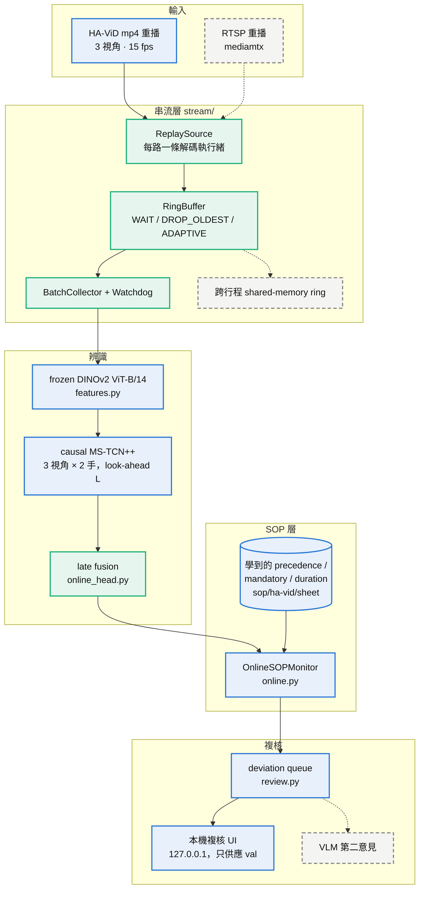

# sop-video-monitor

[](LICENSE)

多攝影機 SOP 序列監控的研究原型。HA-ViD 三路固定視角影片進來，frozen DINOv2 抽特徵，每個視角一個 causal MS-TCN++
辨識步驟，從 train 學出的 precedence 知識逐影格檢查順序、遺漏與時長，偏差進佇列由人複核。每個數字都能從已 commit
的表格重算，CI 每次都重算一遍。


## 現況

- HA-ViD 的 frozen test split 依事先登記的 protocol 評估過一次，之後不再使用；其餘數字都是 validation 上的開發結果。
- 辨識器是瓶頸：短的 insert 步驟連 offline 模型都認不出來，預測序列在每一支 test 錄影上都觸發警報。
- 一張 RTX 4090 可即時解碼並抽特徵 24 路 15 fps 攝影機；單站三視角從 mp4 到偏差為 0.32 倍即時。
- 尚未做：RTSP 重播、跨行程 ring buffer、VLM 第二意見、真人複核結果。

### 架構：實線＝已實作，綠＝已量測，虛線＝未做



## 結果：HA-ViD held-out subjects，只評估一次

primitive task、三視角 mean fusion、三個 seed 的 mean ± std：

| 設定 | 輸出延遲 | F1@10 左手 | F1@10 右手 | 必要步驟 frame recall |
|---|---|---|---|---|
| causal L = 0 | 0 s | 26.9 ± 1.8 | 28.8 ± 0.4 | 28.5 % |
| causal L = 90（事先登記的 L\*） | 6 s | 30.5 ± 0.1 | 30.2 ± 1.1 | 35.5 % |
| causal L = 45（看過 val 後追加，非事先登記） | 3 s | 32.9 ± 1.9 | 34.1 ± 1.2 | 40.3 % |
| offline（非線上結果） | — | 39.7 ± 1.0 | 42.2 ± 0.2 | 46.4 % |

SOP 檢查在 ground truth 上找得到所有 synthetic 違規；原生 `w` 錯誤偵測 0 / 16。


*直接從已 commit 的表格畫出，不是手繪：ground truth 0 個警報，預測串流 10 個。*

## 資料

| 資料集 | 角色 | 授權 |
|---|---|---|
| HA-ViD | 主力：203 段標註錄影 × 3 視角，subject-wise split 凍結，test 已用過一次 | CC BY-NC 4.0 |
| IndustReal | 指標捐贈與開發，只用 train／val | Apache-2.0 |

## 開發

```bash
uv sync --all-extras                    # 最小安裝（CI 用，不裝 torch）
uv sync --all-extras --group baseline   # 加 torch 2.13 (cu130) 與 PyAV：解碼、特徵、訓練
make lint test reproduce-lite           # 檢查、測試、從已 commit 的表格重算所有報告
make features-havid havid-tas-v3 havid-sop-v8   # 特徵 → 辨識器 → SOP 檢查（需要本機 HA-ViD）
make figures                            # 重新渲染動畫（先 uv sync --group figures，需要 ffmpeg）
```

## 文件地圖

| 想知道 | 看 |
|---|---|
| 每個 run 回答什麼問題、數字從哪來 | [reports/README.md](reports/README.md) |
| 正式結果與事先登記的 protocol | [reports/havid_test_v1.md](reports/havid_test_v1.md)、[docs/havid_test_protocol.md](docs/havid_test_protocol.md) |
| 沒有展示什麼、哪些宣稱不能寫 | [docs/what_this_does_not_show.md](docs/what_this_does_not_show.md)、[docs/claims_audit.md](docs/claims_audit.md) |
| 每個決定與原因 | [docs/decisions.md](docs/decisions.md) |
| 模組與 CLI 一覽 | [docs/code_map.md](docs/code_map.md) |
| 線上監控的狀態機、串流路徑、學到的 SOP 知識 | [docs/online_monitor.md](docs/online_monitor.md)、[docs/streaming.md](docs/streaming.md)、[docs/sop_knowledge.md](docs/sop_knowledge.md) |
| 複核介面 | [docs/review.md](docs/review.md) |
| 動畫的來源與授權 | [docs/assets/README.md](docs/assets/README.md) |
| model card 與授權細節 | [MODEL_CARD.md](MODEL_CARD.md) |

程式碼 Apache-2.0；HA-ViD 的衍生物（特徵、權重、學到的知識、時間軸 GIF）為 CC BY-NC 4.0，不由本 LICENSE 重新授權。
