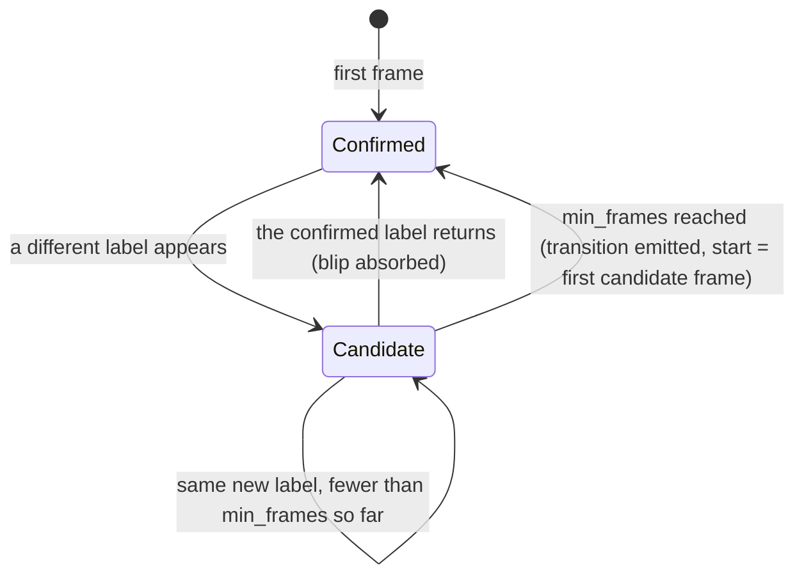
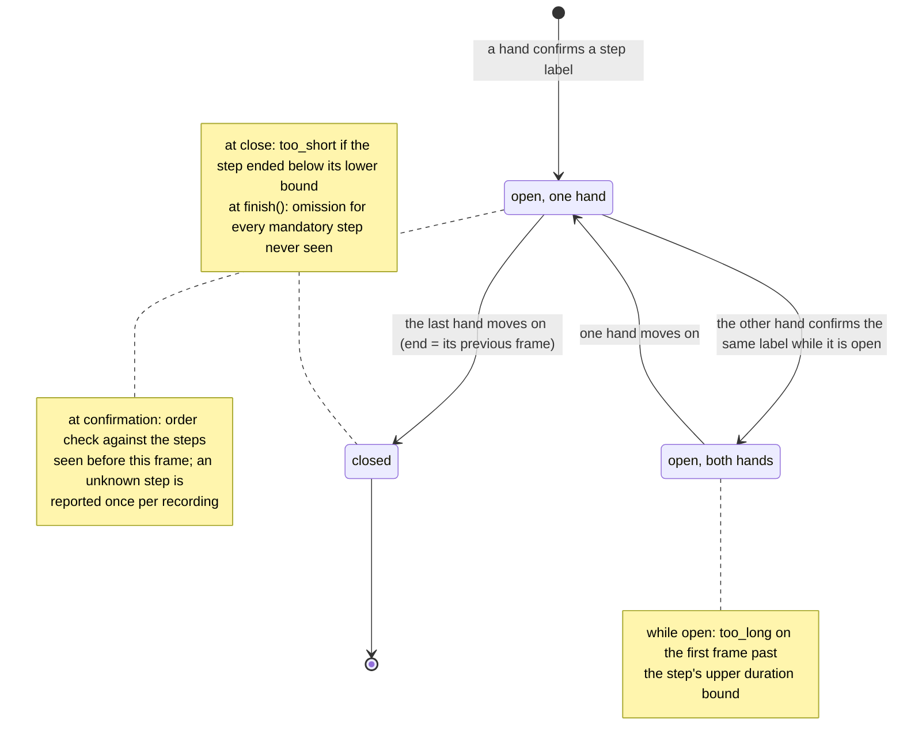

# The online SOP monitor, as state machines

`src/sop_monitor/online.py` turns two per-frame label streams (one per hand) into deviations at
the earliest frame each one is knowable. This page draws the two machines the code keeps and says
when each kind of deviation can fire. The frame-by-frame replay of a real recording is
`docs/assets/sop_timeline.gif`; the equivalence with the offline checker is tested in
`tests/test_online.py`.

## 1. Per hand: the run-length segmenter

A label has to last `min_frames` frames before it counts. Shorter blips are absorbed into the label
that was confirmed before them, which is the online form of `smooth_segments`.

## 2. Per step: open, joined, closed

A transition on one hand opens a step. If the other hand is inside a step with the same label, the
new segment joins it instead of opening a second step (the online form of `step_sequence`). Steps
that start on the same frame are simultaneous: neither precedes the other, on this monitor and in
the offline checker alike (`check_step_order`).

## 3. When each deviation is knowable

| deviation | fires | latency after the step starts |
|---|---|---|
| unknown step | at confirmation | `min_frames − 1` frames, plus the recogniser's output delay `L` |
| order | at confirmation | same |
| too_long | while the step is still running | its upper bound, plus `L` |
| too_short | when the step closes | its length, plus `L` |
| omission | when the recording ends | not knowable earlier |

With `min_frames = 1` the set of findings on a finished recording equals `check_sequence`'s, with
one documented exception: two adjacent segments with the same label are one step online, because a
frame stream cannot separate them (149 of 5,871 annotation boundaries; a recogniser's output never
contains them).
