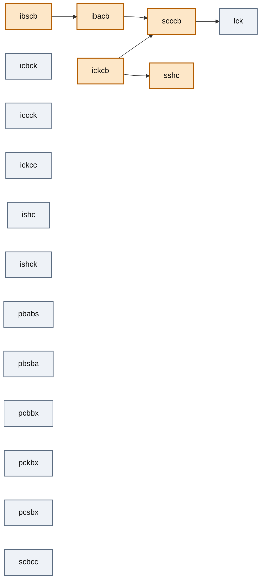
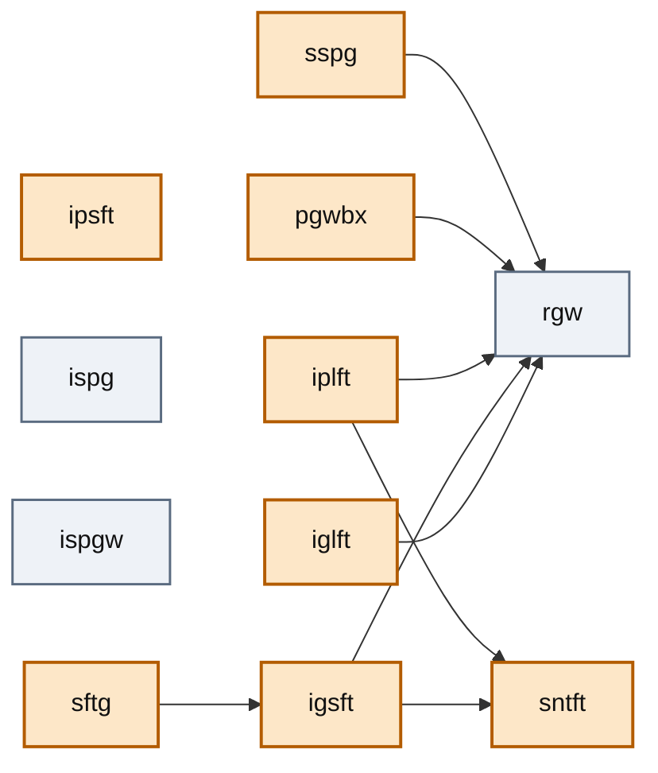
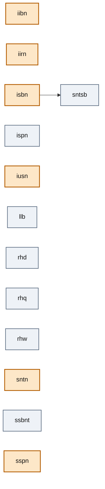

# Learned HA-ViD procedure knowledge, drawn

Generated by `sop-monitor export-sop-mermaid --graphs sop/ha-vid/sheet` from the
JSON files the SOP checks read; `tests/test_sop_mermaid.py` fails when this page is stale.
Do not edit by hand.

Every node is an instruction-sheet step (HR-SAT code with the hole index and tool dropped).
An edge `a --> b` is a learned precedence: `a` starts before `b` in every train recording of
the plate in which both occur, with at least 10 such recordings
(min agreement 1.0). Orange nodes are mandatory steps (present
in at least 0.9 of the plate's train recordings); an omission
is only ever reported for those. Steps without an edge are still nodes: the order check has
nothing to say about them, which is most of the `general` plate.

## cylinder plate: 17 steps, 5 precedence edges, 5 mandatory, 10 with duration windows

| step | mandatory | duration window (s) |
|---|---|---|
| `ibacb` | yes | 1.0 – 6.7 |
| `ibscb` | yes | 1.1 – 9.3 |
| `iccck` |  | 1.6 – 11.7 |
| `ickcb` | yes | 1.4 – 6.3 |
| `ishc` |  | 1.5 – 6.6 |
| `ishck` |  | 1.9 – 3.9 |
| `lck` |  | 0.5 – 9.9 |
| `pckbx` |  | 0.6 – 8.3 |
| `scccb` | yes | 1.9 – 15.7 |
| `sshc` | yes | 1.9 – 25.2 |

## gear plate: 11 steps, 8 precedence edges, 8 mandatory, 10 with duration windows

| step | mandatory | duration window (s) |
|---|---|---|
| `iglft` | yes | 1.7 – 7.2 |
| `igsft` | yes | 1.2 – 7.8 |
| `iplft` | yes | 1.3 – 12.0 |
| `ipsft` | yes | 1.4 – 5.2 |
| `ispgw` |  | 1.9 – 4.8 |
| `pgwbx` | yes | 1.6 – 19.7 |
| `rgw` |  | 0.8 – 7.4 |
| `sftg` | yes | 1.5 – 20.1 |
| `sntft` | yes | 1.2 – 21.1 |
| `sspg` | yes | 2.6 – 24.3 |

## general plate: 13 steps, 1 precedence edges, 6 mandatory, 12 with duration windows

| step | mandatory | duration window (s) |
|---|---|---|
| `iibn` | yes | 1.3 – 4.4 |
| `iirn` | yes | 1.6 – 4.8 |
| `isbn` | yes | 1.7 – 9.0 |
| `iusn` | yes | 2.2 – 10.9 |
| `llb` |  | 0.6 – 2.2 |
| `rhd` |  | 0.8 – 3.6 |
| `rhq` |  | 0.6 – 2.1 |
| `rhw` |  | 2.2 – 16.4 |
| `sntn` | yes | 1.2 – 16.3 |
| `sntsb` |  | 3.5 – 31.0 |
| `ssbnt` |  | 3.8 – 12.1 |
| `sspn` | yes | 2.0 – 31.4 |
