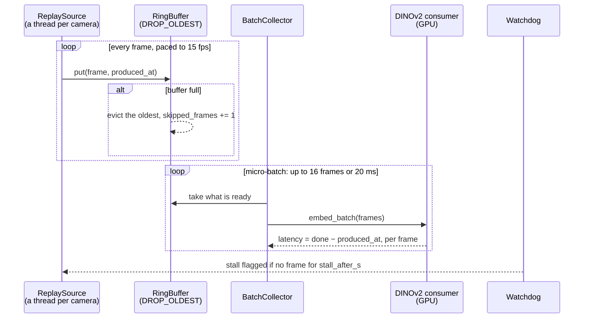
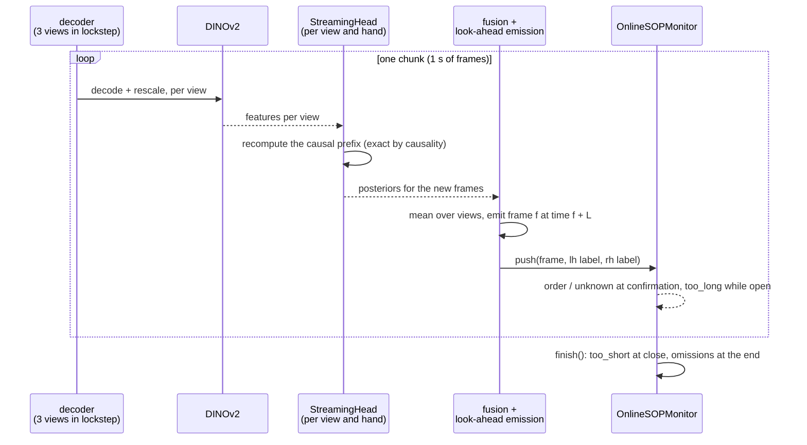

# Streaming: what is built, what is measured, and the gap between them

Two paths exist and they do not yet meet. The first is the concurrent camera pipeline that the
benchmark measures up to the frame embedder; the second is the single-station online head that
runs frames through the recogniser and the SOP monitor. Joining them (several stations' heads
behind one ring-buffer pipeline) is W4 work that is not built.

## 1. The measured pipeline (`src/sop_monitor/stream/`, `reports/stream_bench_v1_*`)

On one RTX 4090, 24 replayed cameras at 15 fps are decoded and embedded without falling behind;
at 36 the decode threads lag (`reports/stream_bench_v1_dinov2/README.md`).

## 2. The online head for one station (`src/sop_monitor/online_head.py`, `reports/havid_dev_v11_*`)

Three views run from mp4 to deviations at about a third of real time, decoding being more than
half of it; streamed labels equal the offline evaluation of the same networks on all but a few
float16 ties (`reports/havid_dev_v11_online_head_features/README.md`).

## 3. Not built

- RTSP ingestion (mediamtx is not installed) and a cross-process shared-memory ring buffer.
- The heads inside the concurrent loop: the benchmark stops at the embedder, the head runs one
  station at a time, unpaced.
- Per-layer state caching for the heads; each push recomputes the prefix, so cost grows with the
  recording's length.
