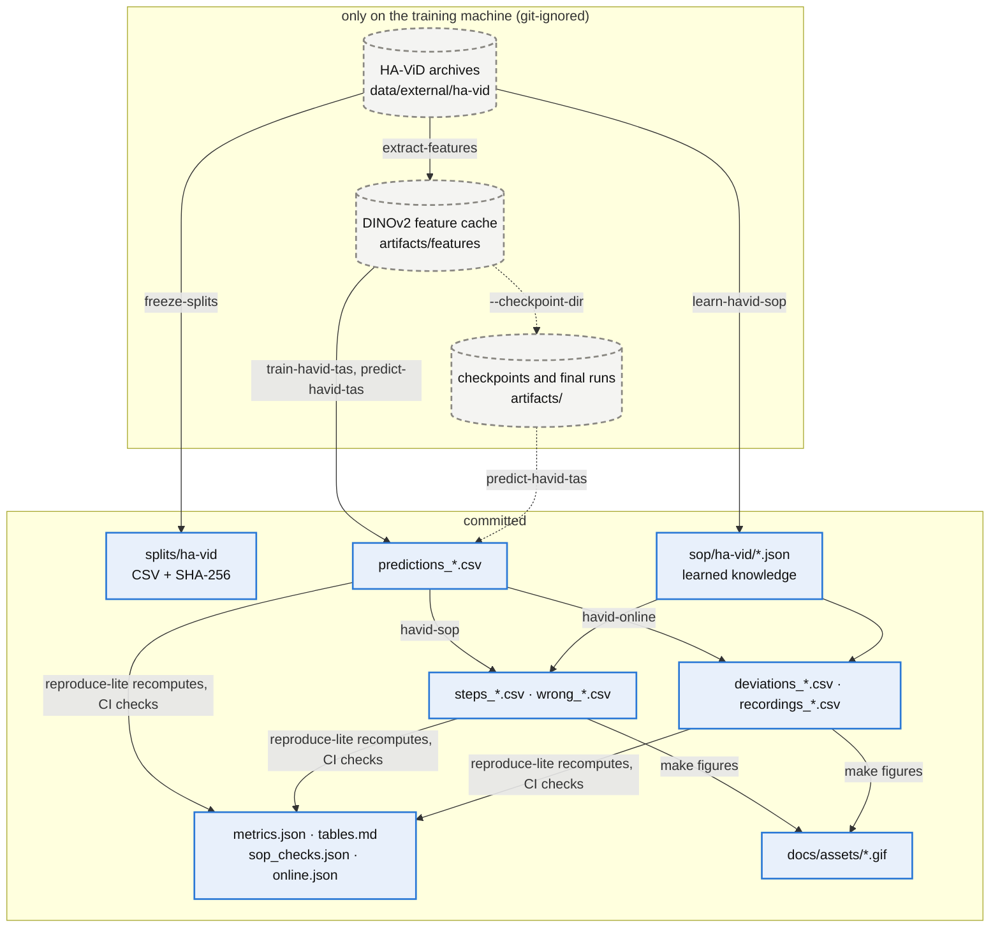
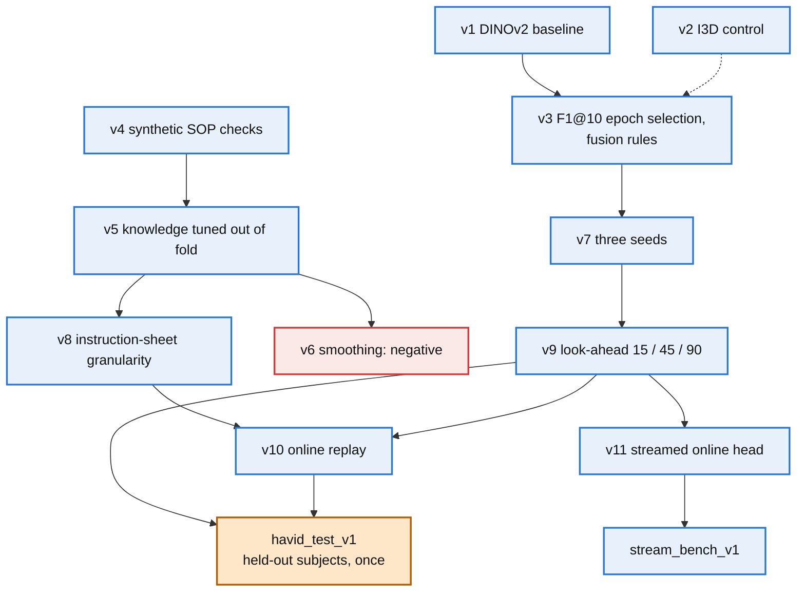
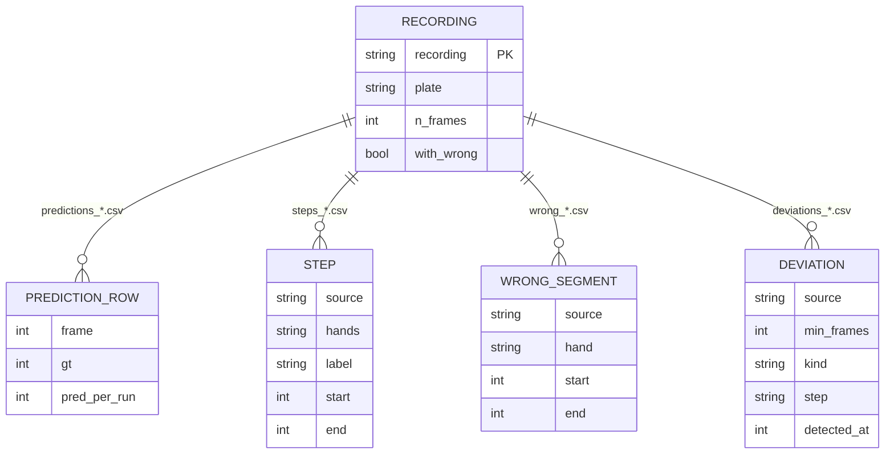

# reports/

Everything under `reports/` is a **development result** on a *validation* split — IndustReal's
(metric-donor dataset, spec 3.1) or HA-ViD's (`splits/ha-vid/val.csv`): real videos, real model
outputs, but val is also where the protocol was iterated. The one exception is the **formal**
HA-ViD test evaluation, [`havid_test_v1.md`](havid_test_v1.md) and the `havid_test_v1_*`
directories: the frozen test subjects, evaluated once under `docs/havid_test_protocol.md`. The HA-ViD delivery is audited in [`havid_audit.md`](havid_audit.md) (W1) and the first
HA-ViD development runs are listed in their own table below.

Start here: for HA-ViD (the main dataset) read **`havid_test_v1.md`** (held-out subjects) and
**`havid_audit.md`**, then
**`havid_dev_v7_tas_seeds_lh/`** (recogniser, three seeds), **`havid_dev_v8_sop_sheet/`** (SOP
checks), **`havid_dev_v9_step_recall/`** (output delay) and **`havid_dev_v10_sop_online/`** (online
checks); for IndustReal, **`industreal_dev_v11_psr_epochsel_f1/`** is the current best
configuration. Every other directory is a step on the way, a control, or a negative result kept as
evidence.

## Where every number comes from

Everything to the right of the dashed nodes is in git; `reproduce-lite` rebuilds every `derived`
file from the committed tables and fails on any drift, without the dataset or a GPU.

## Which run led to which

## IndustReal runs: which run answers which question

| run | question | verdict | status |
|---|---|---|---|
| `industreal_dev_v1/` | Does the pipeline work end to end? Per-frame action baseline (frozen DINOv2 ViT-S/14 + linear head), spec 4.2 metrics | causal MoF 34.0 / F1@50 10.6 on val — a floor | reference (offline TAS line) |
| `industreal_dev_v2_mstcn/` | What does a temporal head add, and what does causality cost? | causal MS-TCN++ Edit 30.2 / F1@50 15.4 vs offline 35.2 / 23.5 | reference (offline TAS line) |
| `industreal_dev_v3_psr/` | First real online metrics (POS / F1 / delay), leave-one-participant-out inside val | POS 0.04 / F1 0.48 — FP-dominated floor | superseded by v4 |
| `industreal_dev_v4_psr_mstcn/` | MS-TCN++ state head × dwell + learned procedure prior (2 × 2) | POS 0.61 / F1 0.71 | superseded by v6 (protocol) |
| `industreal_dev_v5_psr_train/` | Fit on the 36 train recordings instead of leave-one-out | linear improves, MS-TCN++ does not; in-sample decoder selection is unstable | superseded by v6 |
| `industreal_dev_v6_psr_nested/` | Decoder selected on out-of-fold train predictions, 3 seeds | F1 0.759 (linear) / 0.745 (MS-TCN++), stable across seeds, but 36–43 s delay | superseded by v7 |
| `industreal_dev_v7_psr_latency/` | Decoder selected under a latency budget; F1-vs-delay fronts | 30 s budget: same F1, 6 s faster; 15 s not reachable with ViT-S | superseded by v8 (features) |
| `industreal_dev_v8_psr_vitb/` | ViT-B/14 instead of ViT-S/14 | whole front moves up/left: POS 0.625 / F1 0.814 / 25.1 s | superseded by v11 (epochs) |
| `industreal_dev_v9_psr_vitl/` | ViT-L/14 instead of ViT-B/14 | linear +0.02 F1, MS-TCN++ unchanged, 2.2× extraction cost | control; ViT-B stays default |
| `industreal_dev_v10_psr_epochsel/` | MS-TCN++ epoch chosen by held-out BCE | picks 20 epochs, decodes worse (F1 0.741) | **negative result** |
| `industreal_dev_v11_psr_epochsel_f1/` | MS-TCN++ epoch chosen by out-of-fold decoded F1 | **POS 0.642 ± 0.035 / F1 0.821 ± 0.004 / 23.6 s** | **current best** |

Numbers are means over seeds where the run has several; CIs and per-video rows are in each
directory's `tables.md`. For scale only (different split, different system): the IndustReal
paper's B3 reports POS 0.797 / F1 0.883 / delay 22.4 s on the test split.

## HA-ViD runs (development results on `splits/ha-vid/val.csv`, 6 subjects; test never read)

| run | question | verdict | status |
|---|---|---|---|
| `havid_dev_v1_tas_lh/` | First HA-ViD offline TAS: per-view causal/offline MS-TCN++ + late fusion on DINOv2 ViT-B/14, primitive tasks, left hand | fusion_causal F1@10 29.1 / Edit 28.3; marginal gain, inside CIs | superseded by v3 (epoch selection) |
| `havid_dev_v1_tas_rh/` | Same, right hand | fusion_causal F1@10 30.3 / Edit 33.5; fusion best, CIs overlap | superseded by v3 (epoch selection) |
| `havid_dev_v2_i3d_lh/` | Control: same protocol on the authors' I3D features, left hand | fusion_causal F1@10 28.7 / Edit 28.0; tied with DINOv2 | control (feature choice) |
| `havid_dev_v2_i3d_rh/` | Same, right hand | fusion_causal F1@10 23.0 / Edit 21.0; fusion below front view | control (feature choice) |
| `havid_dev_v3_tas_f1sel_lh/` | v1 with the epoch chosen by val F1@10 and three parameter-free fusion rules (mean / geometric / confidence-weighted), left hand | fusion_causal F1@10 32.0 / Edit 35.4; rules tied (geometric 32.2) | current HA-ViD TAS protocol |
| `havid_dev_v3_tas_f1sel_rh/` | Same, right hand | fusion_causal F1@10 30.2 / Edit 32.4; geometric best (33.3), inside CIs | current HA-ViD TAS protocol |
| `havid_dev_v3_tas_f1sel_{lh,rh}_s{1,2}/` | Seeds 1 and 2 of the v3 protocol | inputs of v7 | seed runs |
| `havid_dev_v7_tas_seeds_lh/` (+ `_rh`) | How large is seed noise? v3 protocol, seeds 0–2, mean ± std | std 0.3–2.7 points; fusion_causal F1@10 30.5 ± 1.4 / 29.9 ± 0.6; geometric rule 32.2 ± 0.3 / 31.7 ± 1.7; the single-seed v1 → v3 gain was mostly seed luck | reference for every HA-ViD comparison |
| `havid_dev_v4_sop_synthetic/` | W3: learned per-plate precedence / mandatory steps / duration bounds applied to val; synthetic violations on ground-truth and on v3 `fusion_causal` sequences; native `w` | order recall gt 18/18 / pred 15/15, but 16 / 18 clean gt recordings flagged; omission 17/17 with 1 / 18 false alarms; `w` 0 of 12 (underpowered) | superseded by v5 (tuned knowledge) |
| `havid_dev_v5_sop_tuned/` | Graph rule (min support × min agreement) and duration window chosen by leave-one-subject-out on train (`oof.json`); majority rule tested | strict rule at support 20 + [1, 99] % window: clean gt recordings flagged order 8 / 18 (8.5 % of steps), duration 11 / 18 (6.0 % of steps), omission 1 / 18; majority rule only adds false alarms; predicted sequences still flagged everywhere | superseded by v8 (step granularity) |
| `havid_dev_v6_sop_smoothed/` | v5 with a parameter-free minimum-duration filter (11 frames = train 1st percentile) on the predicted segments | predicted steps 354 → 189, duration step false alarms 57.6 → 30.7 %, but every recording still misses 1–4 mandatory steps and 18 / 18 stay flagged | **negative result**: the recogniser is the bottleneck |
| `havid_dev_v8_sop_sheet/` | Instruction-sheet step granularity (hole index and tool dropped: 73 labels → 51 steps), knowledge tuned out of fold | out of fold: order false alarms 32 % → 8 % of recordings; val gt clean recordings flagged order 4 / 18, duration 8 / 18 (4.3 % of steps), omission 1 / 18; 2 of the 4 flagged gt recordings contain native `w`; predicted sequences still flagged 18 / 18 | current SOP knowledge (`sop/ha-vid/sheet`) |
| `havid_dev_v9_tas_la{15,45,90}_{lh,rh}_s{0,1,2}/` | Causal recogniser with a 1 / 3 / 6 s output delay (look-ahead), three seeds, both hands | inputs of the v9 summaries | seed runs |
| `havid_dev_v9_tas_lookahead_la{15,45,90}_{lh,rh}/` | Mean ± std over seeds per look-ahead | L = 45: fusion_causal F1@10 36.4 ± 2.0 / 32.5 ± 1.9 (L = 0: 30.5 / 29.9; offline 43.9 / 42.0); L = 90 worse than L = 45 | reference for the latency trade-off |
| `havid_dev_v9_step_recall/` | Val frame recall per instruction-sheet step at L = 0 / 15 / 45 / 90 and offline (README covers all of v9) | mandatory-step frames 32.8 → 45.0 → 49.7 → 43.4 % (offline 55.8 %): a 3 s delay closes about three quarters of the gap; some insert steps stay unrecognised even offline | current recogniser diagnosis; L\* = 90 by the pre-registered rule, L = 45 added as an amendment |
| `havid_dev_v10_sop_online/` | The SOP checks run frame by frame on ground truth and on every look-ahead stream, confirmation length m ∈ {1, 4, 8, 15, 30} | online = offline findings on 16 / 18 gt recordings (2 adjacent same-label pairs) and 18 / 18 predicted; predicted streams still flag 13.7–14 of 14 clean recordings; m = 8 cuts alarms 18.9 → 11.8 per recording at L = 0; first alarms 15–25 s into the task | m\* = 8 by the pre-registered rule |
| `havid_dev_v11_online_head_features/` (+ `_video`) | Whole online path streamed: frames or cached features → causal L = 45 heads → fusion → online monitor | 9 of 35,946 hand-frames differ from the offline evaluation of the same networks (float16 ties); 3 cameras from mp4 to deviations at 0.32 × real time on one RTX 4090 (decode 55 %) | systems result |
| `stream_bench_v1_dinov2/` (+ `stream_bench_v1_decode/`) | How many 15 fps cameras can be decoded and embedded concurrently? | 24 streams (360 fps) in real time, p95 71 ms; sources fall behind at 36; decode alone reaches 48 | systems measurement (one machine) |
| `havid_final_gate/` | Do the checkpointed final networks reproduce the committed dev runs? | L = 0 with offline twins: 6 / 6 runs identical frame by frame on every prediction column | reproducibility gate of `docs/havid_test_protocol.md` |

## HA-ViD test evaluation (formal, held-out subjects, evaluated once)

| run | contents | verdict |
|---|---|---|
| `havid_test_v1.md` | the report: protocol adherence, all tables, reading | L = 45 (added after val) best online row: F1@10 32.9 / 34.1; L = 0 26.9 / 28.8; pre-registered L\* = 90 30.5 / 30.2; offline 39.7 / 42.2; every predicted recording flagged by the SOP checks; native `w` 0 / 16 |
| `havid_test_v1_tas_L{0,45,90}_{lh,rh}_s{0,1,2}/` | test predictions of the 18 checkpointed networks | inputs |
| `havid_test_v1_seeds_L{0,45,90}_{lh,rh}/` | mean ± std over seeds | recogniser tables |
| `havid_test_v1_sop_L{0,45,90}_s{0,1,2}/` | SOP checks, synthetic and native tables | SOP tables |
| `havid_test_v1_online/` | frame-by-frame replay, m = 1 and m\* = 8 | online alarm table |
| `havid_test_v1_step_recall/` | per-step frame recall | step table |

For scale only (official test subjects, I3D, single view, no fusion; not our split): the HA-ViD
paper's Table 3 reports MS-TCN primitive-task F1@10 36.6 (left hand) / 34.7 (right hand) averaged
over the three views.

## What each directory contains

The committed tables share one key, the recording (a subject × task × instruction id such as
`S01A04I01`); `reproduce-lite` joins them by it:

| file | what it is | regenerated by |
|---|---|---|
| `README.md` | the report: data and model identity, metric definitions, results, failure cases, cost, reproduce commands, what it does not show | by hand |
| `config.json` | dataset, split, features (model, weights SHA-256), head, decoder grids, selected settings, out-of-fold Pareto fronts, training logs, runtime | the training command |
| `predictions_val.csv` (offline TAS runs: `industreal_dev_v1`, `v2`, all `havid_dev_*`) / `completions_val.csv` (`industreal_dev_v3`+) | the real model outputs next to the ground truth — the artefact everything else derives from | the training command |
| `metrics.json` | metrics with participant-bootstrap CIs, per-video rows, seed summary, ground-truth sanity cases | `sop-monitor score-predictions --run <dir>` (no data, no GPU) |
| `tables.md` | markdown rendering of `metrics.json` + `config.json` | `sop-monitor score-predictions --run <dir> --write` |
| `psr_audit.json` (v3+) | per-recording PSR label cross-checks and frame offsets | the training command |
| `sop_checks_<run>.json` (v6+) | precedence / omission checks of ground-truth and predicted completions against `sop/industreal/learned_precedence_*.json` | `sop-monitor check-psr-run` |

`reports/data_audit.json` is the shared on-disk audit of the IndustReal copy and the HA-ViD
public files (`sop-monitor audit-industreal`); `reports/havid_audit.json` + `havid_audit.md` audit
the delivered HA-ViD archives (`sop-monitor audit-havid`). Neither is tied to a run.

`sop-monitor reproduce-lite` (what CI runs) recomputes every `metrics.json`, `tables.md` and
`sop_checks_*.json` from the committed tables and fails on any drift.

## Tiers, never mixed

| tier | meaning | here |
|---|---|---|
| engineering smoke | proves a code path runs; numbers meaningless | none committed (unit tests cover this) |
| **development result** | real data and outputs, evaluated on val, which also drove model selection | all directories above |
| formal research result | one-shot evaluation on a frozen test split (`splits/industreal/`, `splits/ha-vid/`) after the protocol is fixed | none yet — needs an explicit decision |
